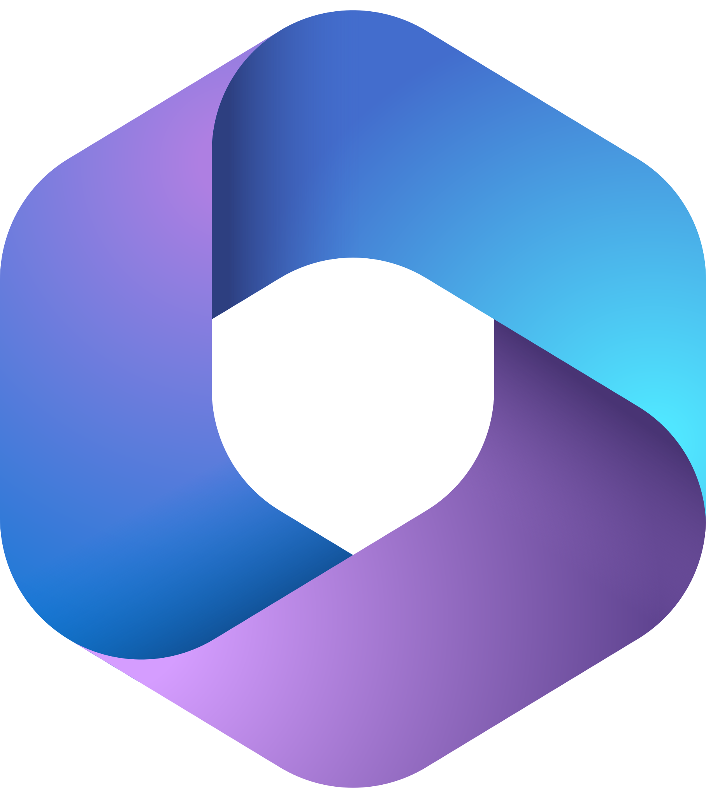
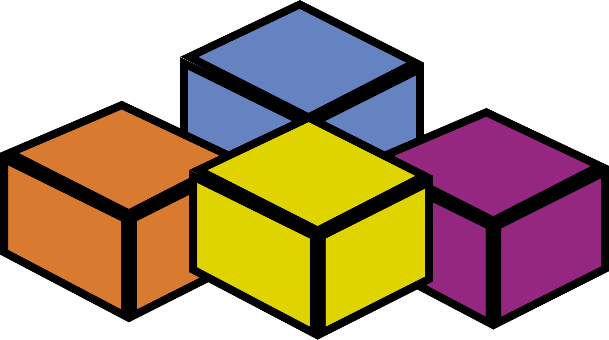
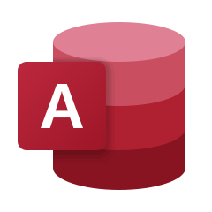
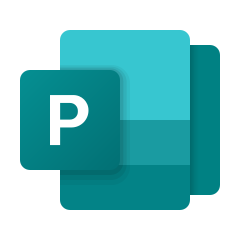
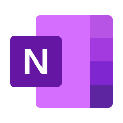

# Hi, i'm_Sejal
Data enthusiast exploring real-world solutions through Excel automation & BI tools.

<!-- Header Section -->

<!-- Typing Animation -->

<!--  -->

<!-- 👤 About Me -->
## 👤 About Me

 

I’m passionate about turning raw data into meaningful business insights.
With strong expertise in Microsoft 365 and growing proficiency in modern data tools like
Power BI, SQL, and Python, I focus on optimizing reports, automating workflows,
and driving smarter business decisions. I’m committed to continuous learning
and delivering data-driven solutions that create real business impact.

<!--  -->

<!-- 🚀 My Mission  -->
## 🚀 My Mission 

<!--  -->

- To simplify complex data for easy interpretation.
- To fulfill my dream of becoming a proficient Data Analyst.
- To create professional and automated reporting systems.
- To continuously learn and apply new data technologies.
- To contribute to data-driven decision making in organizations.

<!--  -->

<!-- 💻 My Skills -->
## 💻 My Skills

 

<!-- 💻Languages / ⚙️Tools -->
## 💻Languages / ⚙️Tools

   
   
   
  
 
  
  
  
  
  
  
  
  
  
  
  
  
  
  
  
  
  

 <!--  -->
 <!--  -->
 <!--  -->
 <!--  -->
 <!--  -->
  <!--  -->
 <!--  -->
 <!--  -->
 <!--  -->
 <!--  --> 
<!--  --> 
<!--  -->
<!--  -->
<!--  -->
<!--  -->
<!--  -->
<!--  -->
<!--  -->
<!--  -->
<!--  -->
<!--  -->
<!-- 
<!--  -->
<!--  -->
<!--  -->
<!--   -->          
<!--  -->
<!--  -->
<!--  -->

<!--  -->

<!--  -->
<!--  -->

<!--  -->

<!-- ## 📬 Connect with Me -->
## 📬 Connect with Me

 

<!-- Typing Animation -->

<!-- 
 -->

<!-- ## 📊 GitHub Stats -->
&nbsp;***Github Stats***
<!--  -->

<!--## 📊 GitHub Streak -->
<!--  -->

<!--## 📊 Activity Graph -->
&nbsp;***Activity Graph*** 
<!--  -->

<!-- 

  

 -->

  

<!-- Typing Animation / 🤝 Thanks for Visiting! -->

<!-- Dynamic Repositories Badge (Enable Later) -->
<!--  -->
<!--my_image  -->

